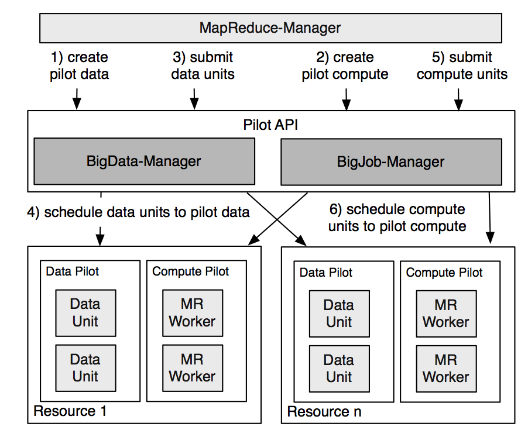

.. _chapter_intro:

************
Introduction
************

Pilot-MapReduce (PMR) is a SAGA-Pilot based implementation of the MapReduce programming model for distributed cyberinfrastructures.
It leverages the capabilities provided by simple, interoperable and scalable SAGA-Pilot abstractions, to decouple job compute/data 
scheduling and monitoring from the resource management. PMR exposes an easy-to-use interface, which provides the complete functionality 
needed by any MapReduce algorithm, while hiding the more complex functionality, such as chunking/splitting of the input, sorting the intermediate 
results, managing and coordinating the map & reduce tasks and related data, etc., which are implemented by the framework.

Below is the architecture of Pilot-MapReduce

